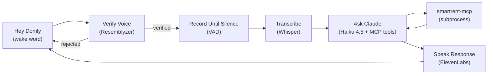

# Domly Build Log

Running journal of the Python sidecar build. Concise, for future reference.

## Architecture Flow



```
Electron UI  <--WebSocket-->  Python Sidecar (this repo)
                                   |
                                   |-- wake word / voice / VAD / STT / TTS (local)
                                   |-- Claude API (Haiku 4.5)
                                   '-- smartrent-mcp subprocess --> SmartRent API
```

## Completed Tasks

1. **Project setup** — `pyproject.toml`, `.env.example`, package skeleton.
2. **Encrypted storage** (`storage.py`) — Fernet-encrypted local cache for SmartRent credentials + voice embedding.
3. **WebSocket server** (`server.py`) — Electron↔Python IPC on `ws://127.0.0.1:8765`.
4. **Audio I/O** (`audio_io.py`) — record/play via `sounddevice`.
5. **Wake word detection** (`wake_word.py`) — using `openwakeword` (deviated from plan's `pvporcupine`), built-in keyword `"hey_jarvis"` for now.
6. **Voice enrollment** (`voice_auth.py`) — Resemblyzer embeddings from sample recordings.
7. **Voice verification** (`voice_auth.py`) — cosine similarity match against enrolled embedding.
8. **VAD / silence detection** (`vad.py`) — auto-stops recording after sustained silence.
9. **Whisper STT** (`stt.py`) — transcribes recorded audio via OpenAI.
10. **MCP client + Claude orchestration** (`mcp_client.py`, `claude_orchestrator.py`) — spawns `smartrent-mcp` via `uvx`, runs Claude's tool-calling loop. Using **Haiku 4.5** model (cheaper/faster, sufficient for simple tool-calling).
11. **ElevenLabs TTS** (`tts.py`) — speaks Claude's response.
12. **Conversation state machine** (`conversation.py`) — wires wake word → verify → transcribe → ask Claude → speak, with an 8s follow-up window.
13. **Main entrypoint** (`main.py`) — full pipeline wired together, runnable via `python -m sidecar.main`.

**Extra (post-plan gap fix):**
- Added `error` broadcast on STT/Claude/TTS failures in `conversation.py` so one bad API call doesn't kill the wake-word loop.

All 13 tasks built TDD-style (test first, watch it fail, then implement) where the code was testable without real hardware/API calls.

## Errors Faced & Fixes

- **`.venv` confusion** — had a `.venv` at the project root but tooling kept creating new ones in subfolders. Eventually consolidated deps into the root `Domly/.venv` via `pip install -e "domly-desktop/python[dev]"`.
- **Accidentally wiped a global pyenv environment** — `uv sync --active` targeted the wrong env (`pyenv/versions/3.13.3`, a shared env with ~200 unrelated packages) instead of the project venv, and uninstalled them all. Restored ~198/200 packages by version; 2 packages from local/ephemeral paths (`/tmp`, deleted OneDrive folder) couldn't be recovered.
- **VAD threshold way too high** — `SILENCE_THRESHOLD = 500` never triggered "speaking" since real mic amplitude during speech was only ~125–460 (headphone mic even lower, ~2). Tuned down to `50`.
- **ElevenLabs `play` import broken** — `from elevenlabs import play` resolved to a submodule, not the function, due to a naming collision in the installed SDK version. Fixed with `from elevenlabs.play import play`.
- **ElevenLabs 402 error** — free-tier API keys can't use library/premade voices (e.g. default "Rachel") via the API anymore. Switched to a voice added to "My Voices" (`Will - Relaxed Optimist`, ID `bIHbv24MWmeRgasZH58o`).
- **ElevenLabs 401 error** — API key was missing the `Voices: Read` permission needed to list account voices via the API.

## Running / Pending Tasks

- **Gap 1: Custom "Hey Domly" wake word** — not started. `openwakeword` has no built-in "Hey Domly" keyword; needs training a custom model via openWakeWord's Colab pipeline (synthetic TTS samples → trained `.onnx` model), then wiring that file into `WakeWordDetector` in place of `"hey_jarvis"`.
